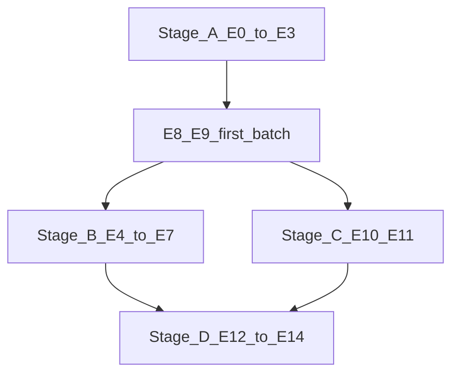

# Autonomous Lottery Ticket Discovery - 项目实施计划

> 本文件是长期路线图。**实验编号唯一标准**：[`docs/refs/Autonomous_Lottery_Ticket_Discovery_experiment_plan.pdf`](docs/refs/Autonomous_Lottery_Ticket_Discovery_experiment_plan.pdf) §31（E0–E14）。执行表：[docs/project/EXPERIMENT_E_MAP.md](docs/project/EXPERIMENT_E_MAP.md)。日志按 E：[docs/project/WORK_LOG.md](docs/project/WORK_LOG.md)。交付：[docs/project/MENTOR_DELIVERY.md](docs/project/MENTOR_DELIVERY.md)。
>
> **更新状态（2026-08-20）**
>
> - **纲领**：E0–E3 = `done_proxy`；下一步 **E8→E9**；E13 不插队。
> - **Non-E 附录**：CIFAR formal100 regime-dependent；GLUE/SQuAD 过渡（不计 E 完成）。
> - **主机**：1×RTX 4090；E 产物 `/mnt/data2/results/E*_*/`。
> - 旧 Phase* / EVIDENCE_PACK / runners：[`archive/README.md`](archive/README.md)。

## 项目概述

本项目旨在实现《Autonomous Lottery Ticket Discovery》方向的自主压缩搜索：物理结构化剪枝 + 可审计搜索 + 恢复，并在严格 train/val/test 协议下对照人工设计路径。

**纲领主线**：E0–E14（PDF「项目/设置」报告）。**视觉附录（Non-E）**：CIFAR regime-dependent（详表见 `archive/docs/EVIDENCE_PACK.md`）。

### 口径（仅 E ID）

| 项 | 口径 |
|----|------|
| 执行顺序 | E0→E1→E2→E3→E8→E9→… |
| E9 | High-Gap recovery — 第一批后半 |
| E13 | Self vs external — Stage D，Gate 后 |

**近端路径（锁定）**：审阅 E0–E3 → **E8→E9** → Gate 后再 Stage B/D。禁止把 Non-E 过渡表改贴成已完成 En。
---
## 阶段划分与实施步骤

### **阶段 0: 环境搭建与基础设施 (预计 3-5 天)**

#### 步骤 0.1: 项目结构初始化
- **任务**: 创建标准的 Python 项目结构
- **产出**:
  ```
  Model-Compression/
  ├── src/
  │   ├── models/          # 神经网络模型定义
  │   ├── pruning/         # 剪枝算法实现
  │   ├── recovery/        # 恢复策略实现
  │   ├── controller/      # 压缩控制器
  │   ├── evaluation/      # 评估与指标
  │   └── utils/           # 工具函数
  ├── configs/             # 配置文件
  ├── experiments/         # 实验脚本
  ├── tests/               # 单元测试
  ├── data/                # 数据集目录
  ├── checkpoints/         # 模型检查点
  ├── logs/                # 训练日志
  └── results/             # 实验结果
  ```

#### 步骤 0.2: 依赖安装
- **任务**: 创建 `requirements.txt` 并安装核心依赖
- **核心依赖**:
  - PyTorch >= 2.0.0
  - torchvision
  - transformers (用于 Transformer 模型)
  - numpy, pandas
  - matplotlib, seaborn (可视化)
  - wandb 或 tensorboard (实验跟踪)
  - pytest (测试框架)
- **验证**: 运行 `python -c "import torch; print(torch.__version__)"`

#### 步骤 0.3: 数据集准备
- **任务**: 下载并预处理基准数据集
- **数据集选择** (按难度递增):
  1. **MNIST**: 简单图像分类 (用于初期验证) [完成] **[CPU 友好，自动下载]**
  2. **CIFAR-10**: 图像分类 [完成] **[已在 RTX 4090 跑通 P1.2]**
  3. **SQuAD 2.0**: 问答任务 (论文主要基准) [必须 GPU] **[P3 规划占位，现阶段不实现]**
  4. **MMLU**: 多任务语言理解 (可选) [必须 GPU] **[必须 GPU]**
- **产出**:
  - `data/mnist/` 或 `data/cifar10/`
  - `data/squad/` (train.json, dev.json) — 未准备
  - 数据加载器：`src/utils/data_loader.py`（含 CIFAR train/val split + `split_hash`）

---

### **阶段 A: 基础组件实现 (预计 7-10 天)**

#### 步骤 A.1: 实现 Dense Baseline 模型
- **状态**: [完成] 已完成（MNIST MLP 基线模型和检查点可用）
- **任务**: 构建并训练完整的密集神经网络作为性能基准
- **模型选择**:
  - **简单**: 3-5 层 MLP (用于 MNIST) [完成] **[CPU 可运行]**
  - **中等**: ResNet-18 (用于 CIFAR-10) [完成] **[已在 RTX 4090 跑通；项目内 `src/models/resnet_cifar.py`]**
  - **复杂**: BERT-base 或 Qwen-0.5B (用于 SQuAD) [必须 GPU] **[P3 规划占位，现阶段不实现]**
- **实现文件**: `src/models/dense_baseline.py`、`src/models/resnet_cifar.py`
- **验证指标**:
  - 记录 baseline 准确率/F1 分数
  - GPU 内存占用
  - 推理延迟
  - 参数量
  - CIFAR smoke 基线约 validation 88.86% / test 87.88%（20 epoch，非论文级 100+ epoch）

#### 步骤 A.2: 实现结构化剪枝算子
- **状态**: [完成] MLP 物理裁剪 + **ResNet BasicBlock 内 conv1** 结构化剪枝（残差 I/O 不变）
- **任务**: 实现论文中的结构化剪枝方法
- **实现文件**: `src/pruning/structured_pruning.py`、`src/pruning/cnn_structured_pruning.py`、`src/pruning/pruning_backend.py`
- **核心功能**:
  ```python
  class StructuredPruning:
      def prune_mlp_layer(self, layer, ratio):
          """剪枝 MLP 层的神经元"""
          pass

      def prune_attention_head(self, attention, ratio):
          """剪枝 Transformer 注意力头"""
          pass

      def apply_mask(self, model, pruning_mask):
          """应用剪枝掩码到模型"""
          pass
  ```
- **验证**: 单元测试确保剪枝后模型可运行

#### 步骤 A.3: 实现敏感度分析 (Self-Diagnosis)
- **状态**: [完成] 已完成（Wanda 神经元重要性已接入自主搜索）
- **任务**: 实现层级敏感度评估方法
- **实现文件**: `src/pruning/sensitivity.py`
- **核心指标**:
  1. **Gradient Sensitivity**: 梯度范数
  2. **Weight Magnitude**: 权重绝对值
  3. **Wanda Score**: 权重×激活值
  4. **SparseGPT Score** (可选,用于 Transformer)
- **函数签名**:
  ```python
  def compute_layer_sensitivity(
      model,
      dataloader,
      method='wanda'
  ) -> dict:
      """
      返回: {layer_name: sensitivity_score}
      """
      pass
  ```

---

### **阶段 B: 前沿分析与候选生成 (预计 5-7 天)**

#### 步骤 B.1: 实现 Capability Frontier Profiling
- **状态**: [完成] `ParetoFrontier` / `FrontierPoint` 已实现并接入自主搜索（validation accuracy vs 真实参数量）；独立 profiling 实验脚本可按需复用
- **任务**: 定义并计算压缩前沿
- **实现文件**: `src/evaluation/frontier.py`
- **核心概念**:
  ```python
  class FrontierProfile:
      def __init__(self):
          self.capability_gap = None      # 性能差距
          self.compression_gap = None     # 压缩差距
          self.context_gap = None         # 上下文差距

      def compute_capability_gap(self, child_acc, parent_acc):
          """计算子网络与父网络的性能差距"""
          return parent_acc - child_acc

      def is_on_frontier(self, sparsity, accuracy):
          """判断是否在帕累托前沿上"""
          pass
  ```

#### 步骤 B.2: 实现 Lottery Ticket Proposal
- **状态**: [完成] MVP 已完成（自主搜索生成确定性层/比例候选并跳过重复配置；独立 proposal 模块尚未拆出）
- **任务**: 基于敏感度生成候选子网络
- **实现文件**: `src/pruning/ticket_proposal.py`
- **策略**:
  1. **Region Selection**: 选择要剪枝的层/模块
     - 基于敏感度排序
     - 跳过首尾层 (保持输入输出维度)
  2. **Pruning Ratio**: 确定剪枝比例
     - 固定比例: 30%, 50%, 70%, 90%
     - 自适应比例: 根据 capability gap 调整
- **产出**: 候选子网络配置列表

#### 步骤 B.3: 实现 Cheap Critic 评估
- **状态**: [完成] 已完成（严格样本上限、无副作用评估和指标测试已覆盖）
- **任务**: 快速评估候选子网络质量
- **实现文件**: `src/evaluation/cheap_critic.py`
- **方法**:
  - 使用小样本数据 (100-500 samples)
  - 计算 loss 而非完整准确率
  - 评估时间 < 1 分钟/候选
- **函数**:
  ```python
  def quick_evaluate(model, mini_dataset):
      """快速评估,返回 loss"""
      pass
  ```

---

### **阶段 C: 恢复策略实现 (预计 7-10 天)**

#### 步骤 C.1: Level 0 - 无恢复
- **状态**: [完成] 已完成（Cheap Critic 与完整验证可直接评估剪枝候选）
- **任务**: 直接评估剪枝后的子网络
- **用途**: 作为对照基准

#### 步骤 C.2: Level 1 - 仅重建
- **状态**: [完成] 已完成（搜索循环已调用 `quick_recovery`，每次剪枝后重新创建优化器）
- **任务**: 在压缩损伤后重新初始化并训练
- **实现文件**: `src/recovery/reconstruction.py`
- **核心逻辑**:
  ```python
  def reconstruction_recovery(child_model, train_loader, epochs=5):
      """
      简单的微调训练
      """
      optimizer = torch.optim.Adam(child_model.parameters())
      for epoch in range(epochs):
          train_one_epoch(child_model, train_loader, optimizer)
      return child_model
  ```

#### 步骤 C.3: Level 2 - LoRA 前沿数据恢复
- **状态**: [完成] 接口已实现（Conv2d/Linear LoRA）；CIFAR 2x 同候选消融已跑通。**单 seed、仅 validation**；未证明系统优于 Level 1
- **任务**: 使用 LoRA 适配器恢复剪枝后模型
- **实现文件**: `src/recovery/lora_recovery.py`、`src/recovery/recovery_dispatch.py`
- **硬件需求**: [建议 GPU] **[已在 RTX 4090 / fp16 验证]**
- **要点**:
  1. 冻结 base 权重，仅训练低秩适配器
  2. 适配器与 base 同设备；AMP 下残差在 fp32 计算；stride 与 base 对齐
  3. 报告部署体积时区分 pruned 基础参数与适配器开销

#### 步骤 C.4: Level 3 - Self-Distillation
- **状态**: [完成] 接口已实现；CIFAR 2x 同候选消融已跑通。**单 seed**；未证明系统优于 Level 1
- **任务**: 使用冻结 baseline 作为教师进行知识蒸馏
- **实现文件**: `src/recovery/self_distillation.py`
- **硬件需求**: [建议 GPU] **[已在 RTX 4090 验证]**
- **损失函数**: soft KL（温度）+ hard CE；见实现与 `configs/cifar_recovery_ablation.yaml`

---

### **阶段 D: 压缩控制器实现 (预计 5-7 天)**

#### 步骤 D.1: 实现简单的启发式控制器
- **状态**: [完成] 已完成（`accept`、`reject`、`rollback`、`regrow` 和重复候选优先级均已测试）
- **任务**: 基于规则的决策逻辑
- **实现文件**: `src/controller/heuristic_controller.py`
- **决策规则**:
  ```python
  class HeuristicController:
      def decide_action(self, profile, candidate, history):
          """
          返回: 'accept', 'reject', 'rollback', 'regrow'
          """
          if profile.capability_gap < threshold:
              return 'accept'
          elif candidate.quality < min_quality:
              return 'reject'
          elif len(history.failures) > max_failures:
              return 'rollback'
          else:
              return 'regrow'
  ```

#### 步骤 D.2: 实现自适应规则控制器 (可选)
- **状态**: [未开始] 未开始
- **任务**: 基于历史动态调整决策
- **实现文件**: `src/controller/adaptive_controller.py`
- **特性**:
  - 根据 capability gap 调整剪枝比例
  - 根据 failure mode 调整恢复策略
  - 动态调整搜索预算

#### 步骤 D.3: 实现 LLM-based 控制器 (高级,可选)
- **状态**: [未开始] 未开始
- **任务**: 使用语言模型进行推理决策
- **实现文件**: `src/controller/llm_controller.py`
- **步骤**:
  1. 构造 prompt 模板
  2. 调用 OpenAI API 或本地 LLM
  3. 解析 LLM 输出为决策

---

### **阶段 E: 端到端流程集成 (预计 5-7 天)**

#### 步骤 E.1: 实现主搜索循环
- **状态**: [完成] MVP 已完成（Wanda 评分、候选深拷贝、Cheap Critic、恢复、全量验证、接受/回滚及 JSON 安全历史）
- **任务**: 整合所有模块,实现完整的自主搜索
- **实现文件**: `src/autonomous_search.py`
- **伪代码**:
```python
def autonomous_lottery_ticket_discovery(
    parent_model,
    train_loader,
    val_loader,
    max_iterations=10,
    target_sparsity=0.9
):
    """
    主搜索循环
    """
    history = SearchHistory()
    current_model = parent_model

    for iteration in range(max_iterations):
        # 1. Self-Diagnosis
        sensitivity = compute_layer_sensitivity(current_model, train_loader)

        # 2. Profile Frontier
        profile = compute_frontier_profile(current_model, val_loader)

        # 3. Propose Candidates
        candidates = generate_ticket_candidates(
            current_model,
            sensitivity,
            k=5
        )

        # 4. Cheap Evaluation
        scored_candidates = [
            (cand, cheap_critic(cand)) for cand in candidates
        ]
        best_candidate = max(scored_candidates, key=lambda x: x[1])

        # 5. Controller Decision
        action = controller.decide_action(profile, best_candidate, history)

        if action == 'accept':
            # 6. Recovery
            current_model = apply_recovery(
                best_candidate,
                train_loader,
                level=2
            )
            history.add_success(current_model, profile)

        elif action == 'rollback':
            current_model = history.get_last_accepted()

        elif action == 'regrow':
            current_model = regrow_layers(current_model)

        # 7. Full Evaluation
        accuracy = full_evaluate(current_model, val_loader)
        print(f"Iteration {iteration}: Accuracy={accuracy:.2f}%")

        # 8. Check Stopping Condition
        if profile.capability_gap < 0.01 and get_sparsity(current_model) >= target_sparsity:
            break

    return current_model, history
```

#### 步骤 E.2: 实现配置管理
- **状态**: [完成] MVP 已完成（CPU 专用 YAML、必填项和数值范围校验、统一随机种子）
- **任务**: 创建配置文件系统
- **实现文件**: `configs/default.yaml`
- **配置项**:
```yaml
model:
  type: "mlp"  # mlp, resnet, bert
  hidden_dims: [512, 256, 128]

pruning:
  method: "wanda"  # wanda, magnitude, gradient
  target_sparsity: 0.9
  structured: true

recovery:
  level: 2  # 0-3
  lora_rank: 8
  distillation_temp: 2.0

controller:
  type: "heuristic"  # heuristic, adaptive, llm
  capability_threshold: 0.05
  max_failures: 3

training:
  batch_size: 64
  learning_rate: 0.001
  epochs: 20

search:
  max_iterations: 10
  candidates_per_round: 5
  search_budget_hours: 24
```

#### 步骤 E.3: 实现日志与可视化
- **状态**: [完成] MVP 已完成（JSONL、summary JSON、CSV、checkpoint 和 PNG 搜索历史图）
- **任务**: 记录实验过程并可视化结果
- **实现文件**: `src/utils/logger.py`, `src/utils/visualizer.py`
- **功能**:
  1. 保存每轮迭代的指标
  2. 绘制稀疏度-准确率曲线
  3. 可视化搜索轨迹
  4. 导出实验报告

---

### **阶段 F: 实验验证 (预计 7-10 天)**

#### 步骤 F.1: 单元测试
- **状态**: [完成] 全量 `python -m pytest tests -q` → **121 passed, 1 skipped**（含 CNN 剪枝、压缩目标、搜索止损、LoRA/蒸馏等）
- **任务**: 为每个模块编写测试
- **测试文件**: `tests/test_*.py`
- **覆盖**:
  - 剪枝操作正确性（MLP + ResNet conv1）
  - 敏感度计算准确性
  - 恢复策略与 dispatch
  - 控制器决策逻辑与搜索止损

#### 步骤 F.2: 小规模验证实验（MNIST）
- **状态**: [完成] MNIST CPU 冒烟 + **MNIST P1.2 GPU** smoke/formal/3-seed/6×3 sweep
- **任务**: 在 MNIST 上验证完整流程与六方法对照
- **实验脚本**: `experiments/run_p12_comparison.py`、`experiments/run_p12_multiseed.py`
- **验证点**:
  - Dense baseline 与 dense_small（从零训练）协议正确
  - One-shot 高压缩崩溃（负结果保留）
  - 迭代 / 自主搜索在高压缩下仍接近 baseline（约 97–98%）

#### 步骤 F.2b: CIFAR-10 + ResNet-18 P1.2（P2）
- **状态**: [完成] 协议与主证据已齐；详见 WORK_LOG §2.2–2.8 与 [archive/docs/P2_EXECUTION_PLAN.md](archive/docs/P2_EXECUTION_PLAN.md)
- **任务**: 同一六方法协议迁移到 CNN
- **要点**:
  - 只剪 BasicBlock 内 `conv1`；残差 I/O 宽度不变
  - `target_compression_ratio` 推导全部 prunable conv1；搜索 `target_compression_reached` 止损
  - 产物：`results/cifar_p12_comparison_gpu_sweep_v2/`、`results/cifar_recovery_ablation/`
- **结论边界（必须遵守）**:
  - **1.5x / 2.0x**：search 与 iterative **同压缩**，可公平对照；iterative 略优或接近，**不能**声称 search 系统更优
  - **≥4x**：search 常因 2 点能力门禁欠压；iterative 仍打到目标（10x test 约 83.4%）
  - 旧 sweep search=1.00x 与 7.66x 过冲 formal **不得**与同压缩表混写
  - 20 epoch 基线约 88% val，非正式论文级精度

#### 步骤 F.3: 复现论文实验 E1（Qwen / SQuAD）
- **状态**: [未开始] 对应纲领 **E0+**；入口见 E-MAP（勿用旧 Phase 记号）
- **任务**: Dense Baseline 对比 (对应论文 Table 1)
- **硬件需求**: [必须 GPU] **[必须 GPU ≥16GB，Qwen-0.5B 模型大，CPU 完全不可行]**
- **实验配置**:
  - Model: Qwen-0.5B
  - Dataset: SQuAD 2.0
  - 对比: Dense vs One-shot Wanda vs Iterative IMP
- **预期结果**:
  - Dense: ~85% F1
  - One-shot 90% sparsity: ~60% F1
  - Our method 90% sparsity: >75% F1

#### 步骤 F.4: 复现论文实验 E2
- **状态**: [未开始] **P3 规划占位**（需 GPU 和多次完整训练）
- **任务**: 热稀疏度曲线 (对应论文 Figure 2)
- **硬件需求**: [必须 GPU] **[必须 GPU ≥16GB，需要多次完整训练]**
- **实验配置**:
  - 扫描稀疏度: 30%, 50%, 70%, 90%, 95%
  - 记录每个稀疏度下的最佳准确率
- **可视化**: 绘制 Pareto frontier

#### 步骤 F.5: One-shot vs Iterative vs Search 对照
- **状态**: [部分完成] MNIST 与 CIFAR 六方法协议已跑；CIFAR sweep_v2 提供同压缩（1.5x/2.0x）与高压缩欠压边界
- **任务**: 验证自主方法相对传统路径的表现
- **验证**: **当前证据不支持**「CIFAR 上 search 系统优于 iterative」；高压缩主证据仍是 iterative Level-1

#### 步骤 F.6: 消融实验
- **状态**: [部分完成] CIFAR 固定 2x Wanda 候选上 Level 1/2/3 已跑（`results/cifar_recovery_ablation/`）；缺多 seed / test 冻结
- **任务**: 验证各组件的贡献
- **对比组**:
  1. 无恢复 (Level 0) — oneshot 臂已覆盖
  2. 仅重建 (Level 1) — [完成] 消融 + 迭代路径主证据
  3. LoRA 恢复 (Level 2) — [完成] 单次消融接口验证
  4. 自蒸馏 (Level 3) — [完成] 单次消融接口验证
  5. 完整方法 — 搜索路径已有，但高压缩同预算仍受限

---

### **阶段 G: 优化与扩展 (可选,预计 5-7 天)**

#### 步骤 G.1: 性能优化
- **状态**: [未开始]
- **任务**: 加速搜索过程
- **硬件需求**: [必须 GPU] **[必须 GPU，混合精度训练需要 CUDA]**
- **优化点**:
  - 并行化候选评估
  - 缓存中间结果
  - 混合精度训练 (FP16) [必须 GPU] **[需要 GPU with Tensor Cores]**
  - 梯度累积

#### 步骤 G.2: 支持更多模型架构
- **状态**: [未开始]
- **任务**: 扩展到其他模型
- **硬件需求**: [必须 GPU] **[所有大型模型都必须 GPU ≥16GB]**
- **候选**:
  - Vision Transformer (ViT) [必须 GPU] **[GPU ≥12GB]**
  - GPT-2 / LLaMA [必须 GPU] **[GPU ≥16GB]**
  - Diffusion Models [必须 GPU] **[GPU ≥24GB]**

#### 步骤 G.3: 支持更多剪枝策略
- **状态**: [未开始]
- **任务**: 集成其他 SOTA 剪枝方法
- **方法**:
  - SparseGPT
  - Optimal Brain Compression (OBC)
  - Movement Pruning

---

## 实施建议

### 开发顺序
1. **由简到繁**: 先在 MNIST 验证,再到 CIFAR-10,最后到 SQuAD/LLM
2. **模块化**: 每个阶段独立开发和测试
3. **持续集成**: 每完成一个步骤就运行已有测试

### 里程碑检查点
- **Checkpoint 1**: 阶段 A 完成 → Dense baseline 训练成功 [完成]
- **Checkpoint 2**: 阶段 C.2 完成 → One-shot pruning + 简单恢复可运行 [完成]
- **Checkpoint 3**: 阶段 E.1 完成 → 端到端搜索循环可运行 [完成]
- **Checkpoint 4**: 阶段 F.2 完成 → MNIST 实验验证通过 [完成]
- **Checkpoint 4b**: 阶段 F.2b 完成 → CIFAR P1.2 + sweep_v2 / 消融 [完成]
- **Checkpoint 5**: 阶段 F.3 完成 → 论文主实验（Qwen/SQuAD）复现 [未开始 / P3]

### 时间估算
- **最小可行版本 (MVP)**: 阶段 0 + A + B + C.1-C.2 + E → **已完成**
- **视觉域完整证据 (P1+P2)**: MNIST + CIFAR P1.2 → **已完成**
- **论文 LLM 复现**: 阶段 F.3–F.4 → 按 E0–E14；当前 E0–E3 proxy 已开
- **扩展版本**: 阶段 G → 可选

### 技术难点预警
1. **Frontier 计算**: 需要大量候选评估,计算成本高 [建议 GPU] **[GPU 推荐，CPU 耗时 10x+]**
2. **LoRA 恢复**: 超参数敏感；CIFAR 消融已通，系统优势未证明 [建议 GPU]
3. **控制器设计**: 决策逻辑复杂,需多次迭代 [完成] **[CPU 可运行]**
4. **同压缩对照**: 搜索多轮叠加会过冲；已用 `target_compression_reached` 止损；高压缩下能力门禁仍可能导致欠压
5. **大模型实验**: GPU 内存需求高 [必须 GPU] **[必须 GPU ≥16–24GB VRAM]**

---

## 硬件配置需求总结

### 图例说明
- [完成] **[CPU 可运行]**: 可以在 CPU 上完成，性能可接受
- [建议 GPU] **[建议 GPU]**: CPU 可运行但速度慢 5-100 倍，强烈建议使用 GPU
- [必须 GPU] **[必须 GPU]**: CPU 环境不可行，必须使用 GPU

### 当前硬件（RTX 4090 已可用）
**已完成:**
- [完成] MVP / MNIST / CIFAR Non-E 正式全表
- [完成] Stage A E0–E3 proxy（1.5B）

**下一档:**
- [必须 GPU] **E8→E9**（Recovery / High-Gap）
- [pending] E4–E7 / E10–E14（按 Gate；E13 不插队）

### 建议策略
1. **近端**：审阅 E0–E3 → 跑 **E8→E9**
2. Gate 后再 Stage B/D
3. Non-E 数字仅作附录，不改贴成 En

---

## 成功标准

### 最低标准 (MVP / Non-E 视觉)
- [完成] Dense / one-shot / Level-1 恢复 / 端到端搜索可跑
- [√] CIFAR formal100 regime-dependent（Non-E）
- [×] search 系统全面优于 iterative

### 纲领目标（E0–E14）

- [√] **E0–E3** proxy 落盘（须升级到 PDF 规格后再判 Gate A）
- [ ] **E8–E9** 第一批后半
- [ ] **E4–E7** Stage B（Gate A 后）
- [ ] **E10–E11**（Gate B 相关）
- [ ] **E12–E14** Stage D（E13 不插队；Gate E）

### 优秀标准 (超越当期)

- [ ] E14 多代 lineage 全自主（仅当 E12–E13 / Gate E 有信号后）
- [ ] 在更多数据集 / 更大模型上验证 Self-Governance Frontier
- [ ] 搜索时间与审计成本优化

---

## 参考资料

### 论文
1. **主论文**: Autonomous Lottery Ticket Discovery
2. **相关工作**:
   - The Lottery Ticket Hypothesis (Frankle & Carbin, 2019)
   - Wanda: Pruning by Weights and Activations (Sun et al., 2023)
   - SparseGPT (Frantar & Alistarh, 2023)
   - **用途**：人工设计 baseline vs autonomous_search 对照；调研短表见 `archive/docs/PAPER_RESULTS_OUTLINE.md` / `archive/docs/K6_LIT_BASELINE_SHORTLIST.md`

### 代码参考
- PyTorch Pruning Tutorial: https://pytorch.org/tutorials/intermediate/pruning_tutorial.html
- Wanda 官方实现: https://github.com/locuslab/wanda
- PEFT (LoRA): https://github.com/huggingface/peft

### 数据集
- MNIST: `torchvision.datasets.MNIST`
- CIFAR-10: `torchvision.datasets.CIFAR10`
- GLUE: https://gluebenchmark.com/（Non-E 过渡：SST-2 + RTE + QNLI）
- SQuAD 2.0: https://rajpurkar.github.io/SQuAD-explorer/（Non-E 附录）

---

## 纲领实验框架（E0–E14 · 取代旧 Phase*）

唯一标准见 [docs/project/EXPERIMENT_E_MAP.md](docs/project/EXPERIMENT_E_MAP.md) 与 [docs/project/PDF_E_REQUIREMENTS_31_34.md](docs/project/PDF_E_REQUIREMENTS_31_34.md)。工作日志按 E：[docs/project/WORK_LOG.md](docs/project/WORK_LOG.md)。



| Stage | ID | 状态（2026-08-20） |
|-------|-----|-------------------|
| A | E0–E3 | done_proxy |
| C 前半 | E8–E9 | 下一档 |
| B | E4–E7 | pending（Gate A 后） |
| C 余 | E10–E11 | pending |
| D | E12–E14 | pending；E13 不插队 |

Non-E（CIFAR / GLUE / SQuAD）数字见 WORK_LOG Non-E 与 MENTOR_DELIVERY；历史详表在 `archive/docs/EVIDENCE_PACK.md`。

---

## 下一步行动

1. [√] Non-E CIFAR formal100 → regime-dependent
2. [√] E0–E3 proxy 落盘
3. **下一档**：**E8→E9**
4. Gate 后再 Stage B / D；不启动 E13
5. 主文是否只押 CIFAR（Non-E）仍待拍板

执行与结论以 [docs/project/EXPERIMENT_E_MAP.md](docs/project/EXPERIMENT_E_MAP.md) / [docs/project/WORK_LOG.md](docs/project/WORK_LOG.md) / [docs/project/MENTOR_DELIVERY.md](docs/project/MENTOR_DELIVERY.md) 为准。旧 Phase* / EXECUTION_PLAN 仅在 `archive/`。
