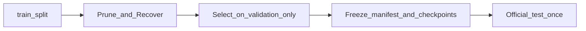

# 证据包（已归档 · 原 Phase H 记号）

> **注意**：本文件已迁入 `archive/docs/`。实验主编号以 PDF **E0–E14** 为准（见 `docs/EXPERIMENT_E_MAP.md` / `docs/WORK_LOG.md`）。下文仅保留 CIFAR/MNIST 历史详表。
>
> 用途：论文 / 答辩 / 交接时的证据索引与叙事提纲（历史）。
> 现行日志：[../../docs/WORK_LOG.md](../../docs/WORK_LOG.md) · 精简：[../../docs/WORK_LOG_BRIEF.md](../../docs/WORK_LOG_BRIEF.md)
> 日期：2026-08-14（更新：2026-08-15）· 主机：RTX 4090 · 含 20 epoch smoke 与 100 epoch 正式基线

---

## 1. 一句话问题与协议

在 **train / validation / test 严格隔离** 下，用 **Wanda 驱动的物理结构化剪枝 + 自主搜索**，在 MNIST MLP 上完成可复现对照，再把同一协议迁移到 **CIFAR-10 + ResNet-18**。

核心不是「再压一点准确率」，而是：

1. 剪枝是否按 Wanda 索引做 **物理结构缩小**（不是掩码稀疏）
2. 选择是否只看 validation；test 是否只在冻结后出现一次
3. 自主搜索相对 one-shot / 迭代剪枝，在 **同压缩预算** 下是否更稳

---

## 2. 协议流程



| 数据 | 允许用途 |
|------|----------|
| train | 训练、敏感度 / Wanda、恢复微调 |
| validation | Cheap Critic、控制器决定、frontier、模型选择、恢复 best 选择 |
| test | **仅** freeze 后的最终报告；不得参与搜索或超参选择 |

CIFAR 额外约束：只剪 BasicBlock 内 `conv1`，残差块 I/O 宽度不变；`target_compression_ratio` 推导全部 prunable conv1；搜索在 `compression >= target` 后 `target_compression_reached` 止损。

---

## 3. MNIST 主结论

**产物根目录**：`results/p12_comparison_gpu_sweep/`（及同系列 smoke/formal/multiseed）

| 结论 | 要点 |
|------|------|
| 迭代 / 搜索 + 恢复 | 1.5x–10x 下 test 仍约 **97–98%** |
| one-shot 无恢复 | 超过约 2x 后崩溃（负结果保留） |
| dense_small | 必须从零训练；修好后约 **96%** |
| 叙事 | 高压缩下接近 baseline 比「1.5x 超过 dense」更重要 |

---

## 4. CIFAR 同压缩对照

### 4.0 基线层次

| 基线 | checkpoint | val / test（约） | 用途 |
|------|------------|------------------|------|
| 20 epoch smoke | `checkpoints/cifar_resnet18_baseline.pth` | val ~88.9% / test ~87.9% | sweep_v2/v3、消融、调试 |
| **100 epoch 正式** | `checkpoints/cifar_resnet18_baseline_formal100.pth` | best val **91.84%** / test **90.36%** | Phase I.B/全表主结果 |

### 4.1 sweep_v2（20 epoch；历史）

**产物**：`results/cifar_p12_comparison_gpu_sweep_v2/`
**设定**：seeds 42/43/44；`recovery_epochs: 2`；门禁修复 + 目标压缩止损。

| 目标 | oneshot_mag | oneshot_wanda | iterative | search |
|------|-------------|---------------|-----------|--------|
| 1.5x | 1.50x | 1.50x | 1.50x | **1.50x（可比）** |
| 2.0x | 2.01x | 2.01x | 2.01x | **2.01x（可比）** |
| 4.0x–10.0x | 达标 | 达标 | 达标 | 常欠压（见 WORK_LOG §2.8） |

### 4.2 sweep_v3（20 epoch；增量逼近后）

**产物**：`results/cifar_p12_comparison_gpu_sweep_v3/`
**设定**：`max_step_compression=1.75`，`max_iterations=8`（随后 I.A′ 提到 12）。

多数 ≥4x search 已接近目标；残留 `4x seed43` 过冲 / `10x seed42` 欠压，由 I.A′ 修复并短验证（见 §4.3）。

Test（摘录，search vs iterative）：

| 目标 | iterative test | search test | search 压缩均值 |
|------|----------------|-------------|-----------------|
| 2.0x | 87.43±0.41 | 87.73±0.45 | 2.01x |
| 6.0x | 85.47±0.57 | 86.21±0.53 | 6.03x |
| 10.0x | 83.42±0.48 | 83.85±1.24 | 9.56x（含 seed42 欠压） |

### 4.3 I.A′ 边界短验证

**产物**：`results/cifar_p12_ia_prime_validate/`
修复：禁止 target 模式 fallback 全目标比例；过滤 `>target*1.15`；`max_iterations=12`。

| 案例 | 修复前 | 修复后 |
|------|--------|--------|
| 4x seed43 | 6.32x | **4.025x** |
| 10x seed42 | 8.43x | **10.072x** |

### 4.4 正式基线关键对照（Phase I.B）

**产物**：`results/cifar_p12_comparison_gpu_formal100_key/`
**checkpoint**：`cifar_resnet18_baseline_formal100.pth`

| 目标 | iterative comp / test | search comp / test | 同压缩 |
|------|----------------------|--------------------|--------|
| 2.0x | 2.01x / **90.66±0.12** | 2.01x / 90.31±0.52 | **是** |
| 10.0x | 10.16x / 83.76±0.43 | 10.14x / **86.03±0.33** | **是** |

**读表规则**

- 正式基线 test ~90.4%；2x 上 iterative 略优；**10x 同压缩下 search 高于 iterative**（约 +2.3 点）。
- 关键档已由 §4.5 全表覆盖；本节保留为早期关键证据。
- 20 epoch smoke 表与正式基线表必须分列，不得混写为同一主表。

### 4.5 正式全表（formal100_full）

**产物**：`results/cifar_p12_comparison_gpu_formal100_full/`
**设定**：正式基线；1.5/2/4/6/8/10 × 3 seed；I.A′ 边界；全部 ≥4x search 压缩在目标 ±15%。

| 目标 | iterative test | search test | 同压缩 | 读法 |
|------|----------------|-------------|--------|------|
| 1.5x | 90.52±0.30 | 90.64±0.94 | 是 | 接近 |
| 2.0x | **90.66±0.12** | 90.31±0.52 | 是 | iterative 略优 |
| 4.0x | **89.85±0.16** | 89.37±0.16 | 是 | iterative 略优 |
| 6.0x | 88.22±0.38 | 88.25±0.56 | 是 | 持平 |
| 8.0x | 86.67±0.16 | **87.40±0.97** | 是 | search 略优 |
| 10.0x | 83.76±0.43 | **86.03±0.33** | 是 | search 更优 |

**主结论（定稿）**：正式基线下性能是 **regime-dependent**——低–中压缩（≤4x）iterative 略稳或接近；高压缩（≥8x）search 同压缩更强。机制随档位变化（4x 难分；8x 门禁主导；10x 路径+门禁）。**不得**写成 search 全面系统优于 iterative。oneshot ≥4x 仍崩溃。

### 4.6 Crossover 机制消融（10x）

**产物**：`results/cifar_crossover_path_ablation/`
**设定**：formal100；10x；seeds 42/43/44；同 L1 恢复预算。Search-gated 复用 formal100_full。

| Arm | test mean±std | 含义 |
|-----|---------------|------|
| uniform（一次 Wanda + L1） | 82.66±0.72 | 基线路径 |
| incremental_no_gate | 84.78±0.60 | 仅增量、无 2 点门禁 |
| search_gated | **86.03±0.33** | 增量 + 2 点门禁 |

**Verdict：`path_and_gate`** — 增量路径约 +2.1 点，门禁再约 +1.3 点；高压缩 search 优势来自两者叠加。

### 4.7 Crossover 稳健性消融（8x）

**产物**：`results/cifar_crossover_path_ablation_8x/`
**设定**：同协议；目标 **8.0x**；seeds 42/43/44；search_gated 复用 formal100_full `ratio_8_seed_*`。

| Arm | test mean±std | compression |
|-----|---------------|-------------|
| uniform | 85.76±0.81 | 8.06x |
| incremental_no_gate | 85.96±0.46 | 8.14x |
| search_gated | **87.40±0.97** | 8.08x |

**Verdict：`gate_dominant`** — 路径约 +0.2，门禁约 +1.4。

| 档 | path | gate | verdict |
|----|------|------|---------|
| 8x | ~+0.2 | ~+1.4 | `gate_dominant` |
| 10x | ~+2.1 | ~+1.3 | `path_and_gate` |

**读法**：不是 10x 特例；门禁两档都稳定贡献；路径贡献随压缩加剧。仍不声称 search 全面优于 iterative。

### 4.8 低压缩差距诊断（4x）

**产物**：`results/cifar_crossover_path_ablation_4x/`（含 `PROCESS_COMPARE.md`）
**设定**：同三臂；目标 **4.0x**；search_gated 复用 formal100_full `ratio_4_seed_*`。

| Arm | test mean±std | compression |
|-----|---------------|-------------|
| uniform | 89.27±0.14 | 4.02x |
| incremental_no_gate | 89.45±0.39 | 4.02x |
| search_gated | 89.37±0.16 | 4.02x |

**Verdict：`inconclusive_close`**。formal 上 iterative 89.85±0.16 仍略高 ~0.5。

**Process（seed 42/43）**：search 3×accept（~1.75→3.09→4.02）；最终 `layer_keep_indices` 与 iterative **完全相同**。差距来自恢复轨迹，不是缺 path/gate。

| 档 | path | gate | verdict |
|----|------|------|---------|
| 4x | ~+0.2 | ~−0.1 | `inconclusive_close` |
| 8x | ~+0.2 | ~+1.4 | `gate_dominant` |
| 10x | ~+2.1 | ~+1.3 | `path_and_gate` |

**主张**：写成 **regime-dependent**；「系统全面更优」仍 `[×]`。

### 4.9 恢复预算对齐（2x/4x）

**产物**：`results/cifar_p12_budget_match_key/`（含 `BUDGET_REPORT.md`）
**设定**：`iterative_recovery_epochs=6`；search 每 accept 仍 2 epoch；formal100 基线。

| target | iterative | search | delta (it−se) |
|--------|-----------|--------|---------------|
| 2x | 90.56±0.07 | 90.18±0.43 | +0.38 |
| 4x | 90.04±0.18 | 89.43±0.32 | +0.61 |

**读法**：抬高 iterative 预算后仍 ≥ search；低压缩差距不是「iterative 恢复不够」。正式全表主数字不改写。

### 4.10 低压缩一步到目标关键复验

**产物**：`results/cifar_p12_lowcomp_step_key/`（含 `LOWCOMP_STEP_REPORT.md`）
**改动**：`target<=4` 时允许一步到目标；门禁仍 2pt。

| target | iterative | search | delta (se−it) |
|--------|-----------|--------|---------------|
| 2x | 90.56±0.07 | **90.57±0.08** | +0.01 |
| 4x | **89.27±0.15** | 88.87±0.11 | −0.39 |
| 8x | 86.13±0.56 | **86.99±0.53** | +0.86 |
| 10x | 84.14±0.72 | **85.60±0.15** | +1.46 |

**读法**：2x 可抹平；4x 未闭合；高压缩优势保留。不足以勾选「系统全面更优」。

### 4.11 4x 一步变差诊断

**产物**：`results/cifar_p12_lowcomp_step_key/FOURX_PROCESS_COMPARE.md`

- formal：3×accept（~1.75→3.09→4.02）；lowcomp：1×accept（直接 ~4.02）
- 最终层宽 formal == lowcomp == iterative
- **原因**：缺少中间恢复，非选错结构
- **跟进**：代码一步策略收窄为仅 `target<=2`；4x 起保持增量路径

---

## 5. 恢复消融 Level 1/2/3

### 5.1 单 seed（历史）

**产物**：`results/cifar_recovery_ablation/`
**设定**：固定 2.01x Wanda 候选；各 3 epoch；单 seed。

| Level | 方法 | 恢复后 best val | 备注 |
|------|------|-----------------|------|
| — | 剪枝后无恢复 | 23.32% | 对照 |
| 1 | 全参微调 | **88.02%** | 主路径证据 |
| 2 | LoRA | 89.78% | recovered 参数含适配器 |
| 3 | 自蒸馏 | 89.16% | 与 L1 同 pruned 参数量 |

### 5.2 多 seed + test（Phase I.C）

**产物**：`results/cifar_recovery_ablation_multiseed/`
**设定**：seeds 42/43/44；2.01x Wanda；各 3 epoch；冻结后 test。

| Level | val mean±std | test mean±std | 备注 |
|------|--------------|---------------|------|
| 1 | 87.93±0.87 | 87.25±0.82 | 全参微调；主路径 |
| 2 | 90.04±0.07 | 89.22±0.09 | LoRA；参数含适配器 |
| 3 | 89.64±0.42 | 88.51±0.28 | 自蒸馏 |

边界：L2/L3 均值更高，但 L2 参数量略增；主实验路径仍以 Level-1 为准。

---

## 6. 负结果与作废证据（必须保留叙事）

| 现象 | 含义 | 当前状态 |
|------|------|----------|
| one-shot ≥2x 崩溃 | 无恢复时结构剪枝损伤大 | 负结果保留（MNIST/CIFAR 同构） |
| 旧 CIFAR sweep search=1.00x | Critic 在恢复前硬拒，从未压缩 | **作废**；目录已清理，数字见 WORK_LOG §2.5 |
| 门禁修复后 2x formal search=7.66x | 多轮 accept 叠加过冲 | **不作同预算对照**；已用止损修复 |
| sweep_v2 中 ≥4x search 欠压 | 一轮全目标撞 2 点门禁 | I.A 增量逼近缓解；见 sweep_v3 |
| sweep_v3 `4x seed43` 过冲 / `10x seed42` 欠压 | 近目标 fallback / 迭代耗尽 | I.A′ 已修并短验证达标 |

---

## 7. 能写 / 不能写

### 能写

1. [√] 自主搜索 + **物理结构化剪枝**（参数量可测），不是幅值掩码。
2. [√] 可审计搜索：fingerprint、Cheap Critic、淘汰原因、rollback。
3. [√] Pareto 用 validation accuracy vs 真实参数量。
4. [√] 严格三路数据协议；test 冻结后评估一次。
5. [√] CNN：块内中间通道剪枝，残差对齐为硬约束。
6. [√] 对照完整：dense / dense_small / oneshot / iterative / search；保留 oneshot 高压缩失败。
7. [√] 同压缩预算下可公平对照 iterative 与 search（止损 + 增量逼近 + 过冲硬顶）。
8. [√] 正式 100 epoch 全表结论定为 **regime-dependent**：≤4x iterative 略稳；≥8x search 同压缩更高（crossover）。
9. [√] 高压缩优势可归因：**增量路径 + 2 点门禁**；贡献随压缩率变化（4x `inconclusive_close`；8x `gate_dominant`；10x `path_and_gate`）。
10. [√] 多 seed 恢复消融：L2/L3 均值可高于 L1，但须注明 L2 适配器参数。
11. [√] 低压缩（4x）search/iterative 最终结构可相同；小幅差距来自恢复轨迹。
12. [√] 4x 硬一步会因缺中间恢复而变差；一步策略仅约 ≤2x 有用。

### 不能写

- [×] CIFAR 上自主搜索 **全面系统优于** 迭代剪枝。
- [×] LoRA / 自蒸馏 **无条件系统优于** Level 1。
- [×] 把 20 epoch smoke 表与 100 epoch 正式表混为同一主结果。
- [×] 把历史欠压/过冲 search 的高 test 与高压缩 iterative **混比为方法优势**。

---

## 8. 产物路径索引（仅仍存在的）

| 证据 | 路径 |
|------|------|
| CIFAR 同压缩 sweep_v2 | `results/cifar_p12_comparison_gpu_sweep_v2/` |
| CIFAR 同压缩 sweep_v3 | `results/cifar_p12_comparison_gpu_sweep_v3/` |
| I.A′ outlier 短验证 | `results/cifar_p12_ia_prime_validate/` |
| 正式基线关键对照 | `results/cifar_p12_comparison_gpu_formal100_key/` |
| **正式全表 formal100_full** | `results/cifar_p12_comparison_gpu_formal100_full/` |
| **Crossover 路径消融（10x）** | `results/cifar_crossover_path_ablation/` |
| **Crossover 稳健性消融（8x）** | `results/cifar_crossover_path_ablation_8x/` |
| **低压缩差距诊断（4x）** | `results/cifar_crossover_path_ablation_4x/` |
| **恢复预算对齐关键** | `results/cifar_p12_budget_match_key/` |
| **低压缩一步关键复验** | `results/cifar_p12_lowcomp_step_key/` |
| 恢复消融（单 seed） | `results/cifar_recovery_ablation/` |
| 恢复消融（多 seed） | `results/cifar_recovery_ablation_multiseed/` |
| MNIST P1.2 sweep | `results/p12_comparison_gpu_sweep/` |
| 20 epoch / 100 epoch 基线 | `checkpoints/cifar_resnet18_baseline.pth`、`checkpoints/cifar_resnet18_baseline_formal100.pth` |
| 过程日志 / 欠压分析 | `docs/WORK_LOG.md`、`docs/CIFAR_SEARCH_UNDERCOMPRESSION.md` |
| **论文成果提纲** | `docs/PAPER_RESULTS_OUTLINE.md` |

**复现命令指针（不新开长实验）**

```bash
# 正式基线训练
./scripts/run_gpu.sh python experiments/exp_cifar_baseline.py \
  --config configs/cifar_resnet_baseline_gpu_formal.yaml

# 正式全表
./scripts/run_gpu.sh python experiments/run_cifar_p12_multiseed.py \
  --config configs/cifar_p12_gpu_formal100_full.yaml \
  --checkpoint checkpoints/cifar_resnet18_baseline_formal100.pth --sweep

# 正式关键对照
./scripts/run_gpu.sh python experiments/run_cifar_p12_multiseed.py \
  --config configs/cifar_p12_gpu_formal100_key.yaml \
  --checkpoint checkpoints/cifar_resnet18_baseline_formal100.pth --sweep

# 多 seed 恢复消融
./scripts/run_gpu.sh python experiments/run_cifar_recovery_ablation.py \
  --config configs/cifar_recovery_ablation.yaml \
  --checkpoint checkpoints/cifar_resnet18_baseline.pth
```

配置与协议细节：`configs/cifar_p12_gpu_*.yaml`、`docs/P2_EXECUTION_PLAN.md`、`docs/GPU_WORKFLOW.md`。

---

## 9. 论文章节提纲（非全文）

**成果收成稿（推荐从这里写论文）**：[PAPER_RESULTS_OUTLINE.md](PAPER_RESULTS_OUTLINE.md)

### 方法

- 物理结构化剪枝定义（MLP Linear / ResNet 块内 conv1）
- Wanda 重要性（Linear 与 Conv 同构写法）
- 自主搜索：候选生成 → Cheap Critic 排序 → recovery → validation 门禁 → 增量逼近 / 过冲硬顶 / 止损
- 数据协议与审计产物（manifest / fingerprint / history）

### 实验

- 六方法对照矩阵与压缩目标推导
- MNIST：协议正确性 + oneshot 负结果 + 高压缩仍稳
- CIFAR：**仅 formal100 主表**（smoke 分列）；crossover + 机制消融见成果提纲

### 讨论

- 为何必须同压缩预算（1.00x 作废、7.66x 过冲、≥4x 欠压与 I.A′ 修复）
- 2 点能力门禁；4x 难分、8x 门禁主导、10x 路径+门禁
- 低压缩同结构差距来自恢复轨迹；4x 硬一步有害
- 主张写成 regime-dependent；迁移到 Transformer 见 [PHASE_J_QWEN_PLAN.md](PHASE_J_QWEN_PLAN.md)（须扩盘）

---

## 10. Phase H / I 验收自检

图例：`[√]` 已完成 · `[×]` 有问题/证据不支持 · `[ ]` 未做

- [√] 不打开 `results/` 也能复述协议与同压缩结论
- [√] 标明 smoke vs 正式基线，不得混表
- [√] 标明 I.A′ 前后 outlier 与修复
- [√] 正式全表齐全；读出压缩率 crossover
- [√] 10x/8x crossover 消融：门禁稳健；路径贡献随压缩加剧
- [√] 4x 低压缩诊断：`inconclusive_close`；最终层宽可与 iterative 相同
- [√] 预算对齐与一步策略关键实验已记录；仍不足以勾选系统全面更优
- [√] 4x 一步变差已诊断（同层宽、缺中间恢复）；策略收窄为 target<=2
- [√] Phase J 规划已交付（`docs/PHASE_J_QWEN_PLAN.md`）；未下载大模型
- [√] 论文成果提纲已交付（`docs/PAPER_RESULTS_OUTLINE.md`）
- [√] 只索引仍存在的产物路径
- [√] 全文中文、无夸大
- [×] 声称 search **系统全面**优于 iterative — **证据不支持**（应为 regime-dependent；仅 ≥8x 同压缩更高）
