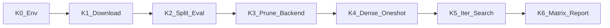

# Phase K — Qwen / SQuAD 实现计划

> 状态：**K0–K4 冒烟 `[√]`（2026-08-15）** · 下一档 = iterative / search 小矩阵 `[ ]`
> 图例：`[√]` 已完成 · `[ ]` 未做 · `[×]` 证据不支持 / 不做
> 规划前身：[PHASE_J_QWEN_PLAN.md](PHASE_J_QWEN_PLAN.md) · 视觉结论：[EVIDENCE_PACK.md](EVIDENCE_PACK.md) / [WORK_LOG.md](WORK_LOG.md)
> 总路线：[PROJECT_PLAN.md](../PROJECT_PLAN.md) · 主机：RTX 4090 · 大文件根：`/mnt/data`（软链 `llm_data/`）

---

## 1. 目标与边界

把 CIFAR 上已验证的协议迁到小型 LLM：

- **物理结构化剪枝**（改模块形状，非掩码稀疏）
- **train / validation / test 严格隔离**（选择只看 validation；test 冻结后一次）
- **同压缩预算对照**：dense / oneshot / iterative+recovery / autonomous_search

核心问题（与视觉域同一句式）：在 LLM 上，search vs iterative 是否仍呈 **regime-dependent**，还是塌成别的形态。

| 做 | 不做（本阶段默认） |
|----|-------------------|
| 1.5B 级 Qwen + SQuAD 2.0 协议与评估 | 7B / 14B |
| head / FFN 物理剪枝 + 参数量审计 | 把权重或 HF 缓存提交进 Git |
| dense / oneshot 冒烟 → 小压缩矩阵 | 重跑 CIFAR formal100 |
| 复用搜索协议（门禁 / frontier / history） | 预设「search 全面更优」 |
| manifest / fingerprint / frozen test 报告 | 放宽视觉域 2pt 门禁叙事到 LLM（须单独消融） |

---

## 2. 锁定设定

| 项 | 锁定值 |
|----|--------|
| 模型 | `Qwen/Qwen2.5-1.5B-Instruct` |
| 本地权重 | `/mnt/data/models/Qwen2.5-1.5B-Instruct` |
| 任务 / 数据 | SQuAD 2.0（`rajpurkar/squad_v2`） |
| 数据缓存 | `/mnt/data/datasets/squad` |
| 主指标 | **F1 / EM**（百分制） |
| 剪枝单元 | attention **KV-group**（整组 query heads + 对应 KV）；FFN **intermediate** |
| 设备 | CUDA（4090 24GB）；环境入口 `source scripts/env_llm.sh` |
| 结果根 | `/mnt/data/results/qwen_*` |

### 数据协议（与视觉同构）

```text
官方 train  --(split_seed, validation_fraction)-->  train' + validation'
官方 validation  -------------------------------->  frozen test（选模/搜索禁止使用）
```

实现：[`src/utils/squad_protocol.py`](../src/utils/squad_protocol.py)
断言：`assert_test_not_in_selection_path`；单元测试见 `tests/test_squad_protocol.py`。

### 存储约定

```bash
source scripts/env_llm.sh
# HF_HOME / TRANSFORMERS_CACHE / HF_DATASETS_CACHE -> /mnt/data/...
# HF_ENDPOINT 默认 https://hf-mirror.com
```

视觉域产物已迁到块存储并软链回仓库路径：

- `results` → `/mnt/data/results/vision`
- `checkpoints` → `/mnt/data/checkpoints/vision`

**磁盘建议**：冒烟后 `/mnt/data` 约剩 19G；做 1.5x–4x 多 seed 小矩阵前，建议块存储扩到合计 **约 100G**（再加约 70G）。

---

## 3. 阶段划分



### K0 — 环境 `[√]`

- [√] `/mnt/data/{hf,datasets,models,results}`
- [√] [`scripts/env_llm.sh`](../scripts/env_llm.sh)
- [√] 依赖：`transformers` / `datasets` / `accelerate` / `evaluate`
- [√] 系统盘清理：迁 `results`/`checkpoints`；移除未用 miniconda；`venv` 改指系统 Python 3.10

### K1 — 下载 `[√]`

- [√] Qwen2.5-1.5B-Instruct → `/mnt/data/models/...`（约 2.9G）
- [√] SQuAD → `/mnt/data/datasets/squad`（train 130319 / official val 11873）
- [√] 系统盘不承载大权重（验收：`df -h /` 不明显上涨）

下载脚本：[`scripts/download_qwen_squad.sh`](../scripts/download_qwen_squad.sh)

### K2 — 协议 + 评估骨架 `[√]`

- [√] train/val/test 划分与元数据
- [√] 配置 [`configs/qwen_squad_smoke.yaml`](../configs/qwen_squad_smoke.yaml)
- [√] 评估 [`experiments/run_qwen_squad_eval.py`](../experiments/run_qwen_squad_eval.py) + [`src/utils/qwen_squad_eval.py`](../src/utils/qwen_squad_eval.py)
- [√] 单测：划分可复现；test 不进 selection path

### K3 — Transformer 物理剪枝 `[√]`

- [√] [`src/pruning/transformer_structured_pruning.py`](../src/pruning/transformer_structured_pruning.py)
- [√] 接入 [`src/pruning/pruning_backend.py`](../src/pruning/pruning_backend.py)（`model_type=qwen|transformer|qwen2`）
- [√] 单测：tiny Qwen2 上 MLP/head 剪后 forward 正常、参数量下降（`tests/test_transformer_structured_pruning.py`）

要点：GQA 下 head 剪枝按 **整 KV-group** 保留，保证 `num_key_value_groups` 一致。

### K4 — dense + oneshot 冒烟 `[√]`

| 模式 | 说明 | 冒烟数字（64 条 carved val，零样本生成，**非正式主表**） |
|------|------|----------------------------------------------------------|
| dense | 未剪枝 | F1/EM ≈ 18.75 |
| oneshot | 全层 MLP intermediate 剪 25%；无恢复 | F1/EM ≈ 18.75；参数 1.54B → 1.25B（约 **1.23x**） |

产物：`/mnt/data/results/qwen_squad_smoke/`
（`dense_metrics.json` / `oneshot_metrics.json` / `smoke_summary.json`）

**解读约束**：该 F1 仅证明管线可跑；提示词 / chat template / 恢复训练未优化，**不得**写入论文主结论。

复跑：

```bash
source scripts/env_llm.sh
export TRITON_CACHE_DIR=/mnt/data/hf/triton
python experiments/run_qwen_squad_eval.py --config configs/qwen_squad_smoke.yaml --mode both
```

### K5 — iterative + autonomous_search 接线 `[ ]`

目标：把视觉域 controller / recovery / 压缩目标止损接到 Qwen backend。

| 子项 | 状态 | 内容 | 验收 |
|------|------|------|------|
| K5.1 | `[ ]` | 候选空间：按层 head-group 比 + FFN intermediate 比 | 与 `prunable_layer_names()` 对齐 |
| K5.2 | `[ ]` | 重要性：幅值或 Wanda 风格激活（先幅值冒烟，再 Wanda） | 可复现 seed |
| K5.3 | `[ ]` | 恢复：短 epoch 指令微调或 SQuAD 监督（先定 **Level-1 全参短恢复**） | 只看 carved validation |
| K5.4 | `[ ]` | 搜索门禁：能力门禁是否迁移 2pt；过冲硬顶；目标压缩止损 | 单独消融，不默认照搬视觉叙事 |
| K5.5 | `[ ]` | 对照脚本：`run_qwen_p12_comparison`（或等价） | dense / oneshot / iterative / search 四方法可跑 |

**明确不做（K5）**：正式全压缩率 × 多 seed 大表（留给 K6）。

### K6 — 小矩阵与报告 `[ ]`

| 子项 | 状态 | 默认 |
|------|------|------|
| 压缩目标 | `[ ]` | **1.5x / 2x / 4x**（先小矩阵；是否上 6x+ 视盘与时间） |
| seed | `[ ]` | 先 1 seed 打通，再 3 seed |
| 恢复预算 | `[ ]` | 四方法对齐（与 CIFAR budget-match 同思想） |
| 冻结 test | `[ ]` | 方法选定后官方 validation **只评一次** |
| 产物 | `[ ]` | `/mnt/data/results/qwen_p12_*` + AGGREGATE 报告 + WORK_LOG 回写 |
| 叙事 | `[ ]` | 允许写 crossover / 接近 / 失败；**禁止**未证成的「系统全面更优」 |

---

## 4. 与视觉域叙事的衔接

CIFAR 定稿：**regime-dependent**（≤4x iterative 略稳；≥8x search 更高；机制随压缩率变）。

LLM 上默认假设（待验，非结论）：

1. 同压缩 + 同恢复预算下，是否仍出现 crossover
2. 门禁（能力跌幅阈值）对 search 的贡献是否仍显著
3. oneshot 在中高压缩是否同样崩溃或可恢复

论文位置：视觉为主结果；LLM 为 **第二域迁移 / 讨论**，见 [PAPER_RESULTS_OUTLINE.md](PAPER_RESULTS_OUTLINE.md)。

---

## 5. 代码与配置索引

| 角色 | 路径 |
|------|------|
| 环境 | `scripts/env_llm.sh` |
| 下载 | `scripts/download_qwen_squad.sh` |
| 冒烟配置 | `configs/qwen_squad_smoke.yaml` |
| 评估入口 | `experiments/run_qwen_squad_eval.py` |
| SQuAD 协议 | `src/utils/squad_protocol.py` |
| 生成式 QA 评估 | `src/utils/qwen_squad_eval.py` |
| 剪枝后端 | `src/pruning/transformer_structured_pruning.py` |
| Backend 解析 | `src/pruning/pruning_backend.py` |
| 冒烟结果 | `/mnt/data/results/qwen_squad_smoke/` |

---

## 6. 验收清单

### 已验收（K0–K4）`[√]`

- [√] 大文件仅在 `/mnt/data`；仓库无权重提交
- [√] SQuAD 划分可复现；test 不进 selection
- [√] 物理剪枝后 forward + 参数量下降（单测 + oneshot 冒烟）
- [√] dense / oneshot JSON 落盘；文档标明冒烟非主表
- [√] 全量 `pytest`：138 passed, 1 skipped（冒烟前后基线）

### 待验收（K5–K6）`[ ]`

- [ ] iterative 与 search 在同一压缩目标下可跑通
- [ ] 至少一张 1.5x–4x 同预算对照表（含 compression 验收带）
- [ ] frozen test 报告与 fingerprint / manifest
- [ ] WORK_LOG / EVIDENCE_PACK 增补 LLM 节；**不**把冒烟 F1 当主结论

---

## 7. 风险与已知债

| 项 | 说明 | 处理 |
|----|------|------|
| 零样本 F1 偏低 | 冒烟未用 chat template / 未微调 | K5 恢复训练后再评；或先加 instruct 模板消融 |
| Triton / Python.h | 删 miniconda 后曾缺头文件 | 已装 `python3.10-dev`；`TRITON_CACHE_DIR` 放到 `/mnt/data` |
| GQA head 剪枝 | 仅整 KV-group | 文档与 API 保持该约束；重要性按 group 聚合 |
| 盘余量 | `/mnt/data` ~19G 空闲 | K6 前扩到 ~100G 合计 |
| 评估速度 | 全 val 生成式评测较慢 | 矩阵阶段可用子集选模 + 冻结后全量/官方 test |

---

## 8. 下一步（立即）`[ ]`

1. [ ] **扩盘**（推荐）：`/mnt/data` → 合计约 100G
2. [ ] **K5**：Level-1 短恢复 + iterative / search 接线到 `TransformerBackend`
3. [ ] **K6**：1.5x / 2x / 4x ×（先 1 seed）同预算四方法表
4. [ ] 回写 [WORK_LOG.md](WORK_LOG.md) / [WORK_LOG_BRIEF.md](WORK_LOG_BRIEF.md)；论文 LLM 段落保持「迁移待验」语气

---

## 9. 相关文档

- [PHASE_J_QWEN_PLAN.md](PHASE_J_QWEN_PLAN.md) — 规划占位 `[√]`
- [EVIDENCE_PACK.md](EVIDENCE_PACK.md) — 视觉域证据包
- [PAPER_RESULTS_OUTLINE.md](PAPER_RESULTS_OUTLINE.md) — 论文提纲
- [P2_EXECUTION_PLAN.md](P2_EXECUTION_PLAN.md) §P2.9
